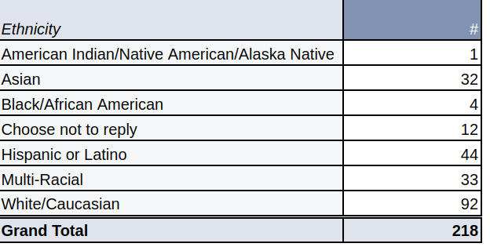
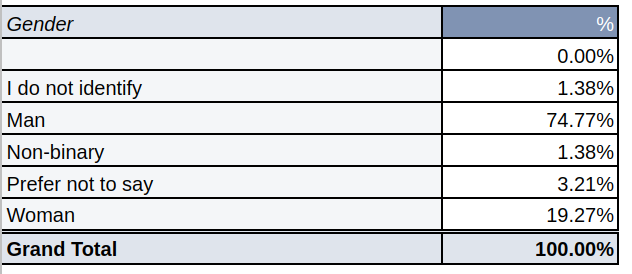
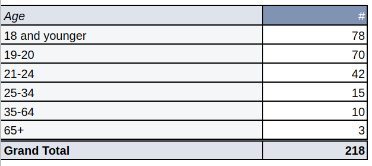
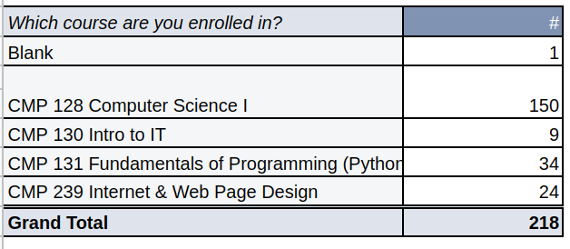
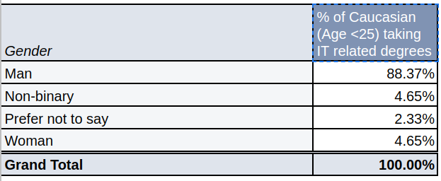
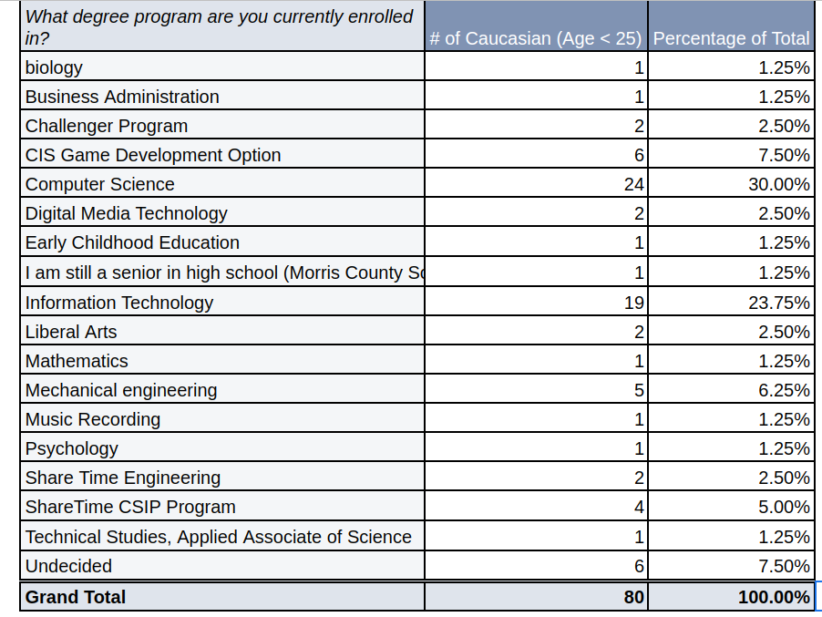
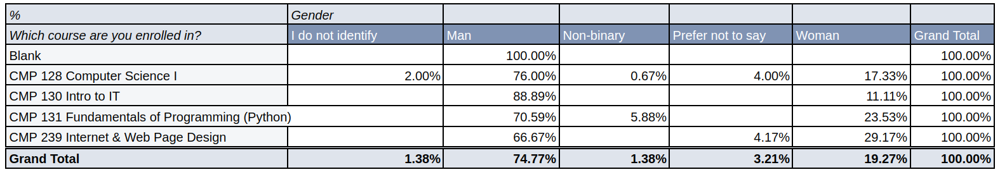
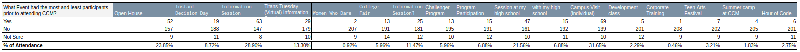

# Project 1 - Data Science Programming

## Questions:

### Basic Demographics

1. How many students from each different class responded to the survey?
2. What are the gender percentages?
3. What is the racial/ethnic diversity? For those students selecting more than one race/ethnicity, assign multi-racial to their category.
4. What is the age distribution for the survey?

### Disaggregation of data

1. What percentage of caucasian under the age of 25 taking each of the introductory IT classes?
2. How many/percentage of causasians under the age of 25 are enrolled in each program at CCM that are taking introductory IT classes?

Two questions from Assignment #1:

1. What is the gender ratio between the different courses?
2. What events/activities had the most and least participants?

### Results!

#### Basic Demographics

##### Question 1:

##### Question 2:

##### Question 3:

##### Question 4:

#### Disaggregation of data

###### What percentage of caucasian under the age of 25 taking each of the introductory IT classes?

The chart shows what percentage of genders of caucasian individuals under 25 are taking IT related degrees. This shows among caucasians under 25, males are the majority.

###### How many/percentage of causasians under the age of 25 are enrolled in each program at CCM that are taking introductory IT classes?

This chart shows how many and what percentage of caucasian and under the age of 25 are taking different programs at CCM. It shows that most that filled out the survey are taking either Computer Science, Information Technology or Mechanical Engineering. This information could be used to branch other departments and programs to show students how important computers are in their fields of study.

##### Two questions from Assignment #1:

###### What is the gender ratio between the different courses?

This chart shows the percentage of males, females, non-binary and no identity individuals in the four IT Classes.

Males dominated every class with women and non-binary making up the minority. This information can be useful to allow better representation of minority groups in the IT World!

###### What events/activities had the most and least participants?

This chart depicts how many people who took the survey went to certain event prior to attending County College of Morris.

The most popular event was Individual Campus visits at **31.65%** and the least popular was the Corporation Training Event at **0.46%**.

#### Insights

The information above can be utilized to cancel unnescessary events and bulster the most popular ones. As well as improve diversity among the students within the IT department, hopefully branching to the IT space as a whole.

#### Sources:

* [Google Sheets](https://docs.google.com/spreadsheets/d/14SDbvSAjEUroPHEJDJbzoeSkspnBRT1Fu-Kxg_1xOKc/edit#gid=1281285375)
